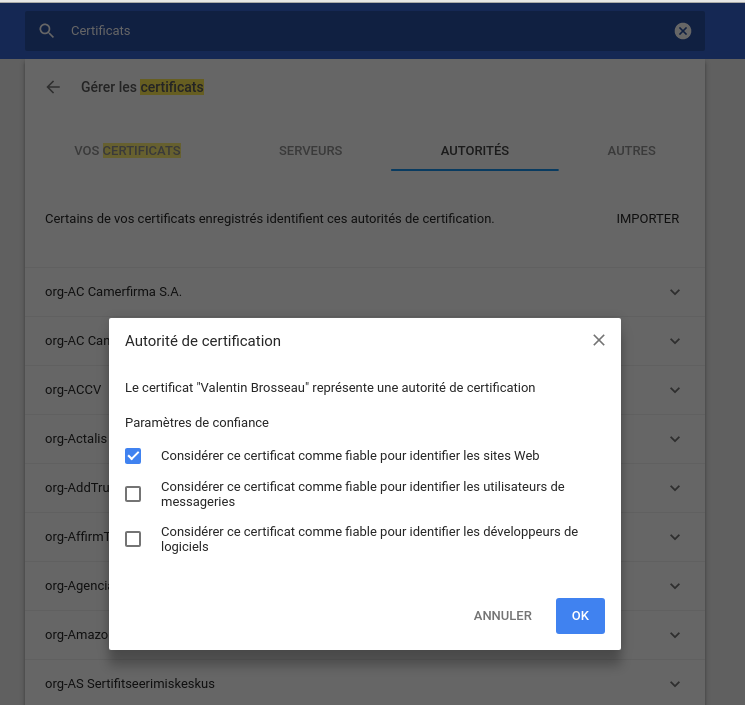
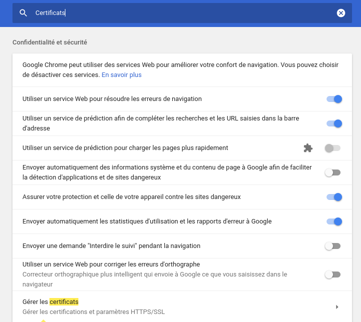
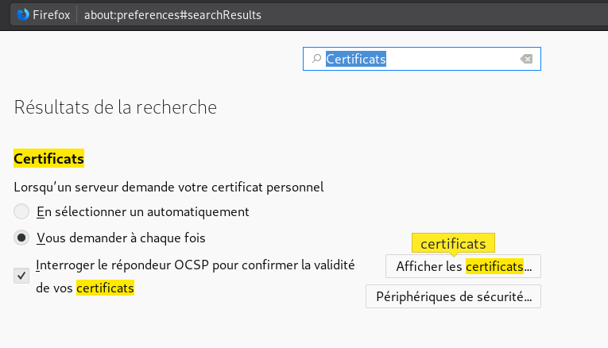
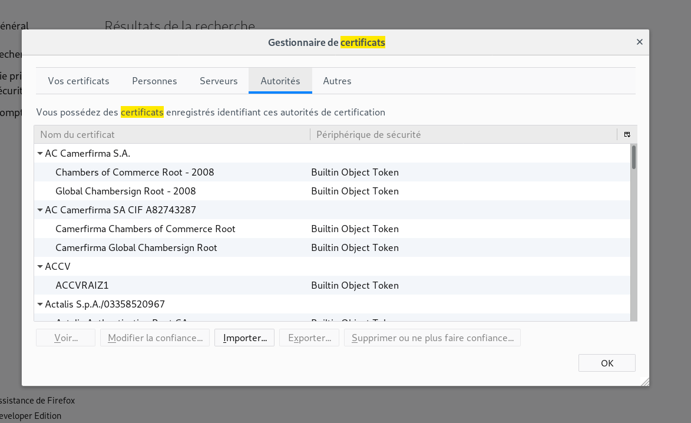

# CA and Certificate generator

Script de génération de CA et de certificats auto-signés « valide ». (Compatible Chrome 58+)

## Utilisation

- Générer la RootCA (```./generate_ca.sh```)
- Générer un Certificat (```./generate_cert.sh```)
- Installer le certificat sur le serveur.
- « Truster » la CA sur votre machine.

## RootCA

Le script de génération de la CA est « generate_ca.sh ». Il est non-interactif pour l’utiliser :

```sh
./generate_ca.sh
```

## Génération d’un nouveau certificat

Le script ```generate_cert.sh``` permet la génération d’un nouveau certificat

```sh
./generate_cert.sh 'www.yolo.test'
# ou
./generate_cert.sh '*.yolo.test'
```

Le script génère l’ensemble de la configuration. Il suffit de copier le ```.crt``` et le ```.key``` sur le serveur pour l’utiliser.

## Installation de la CA

Sur le système :

### Archlinux

```sh
sudo trust anchor ./rootCA/rootCA.crt
```

### Chrome




### Firefox


